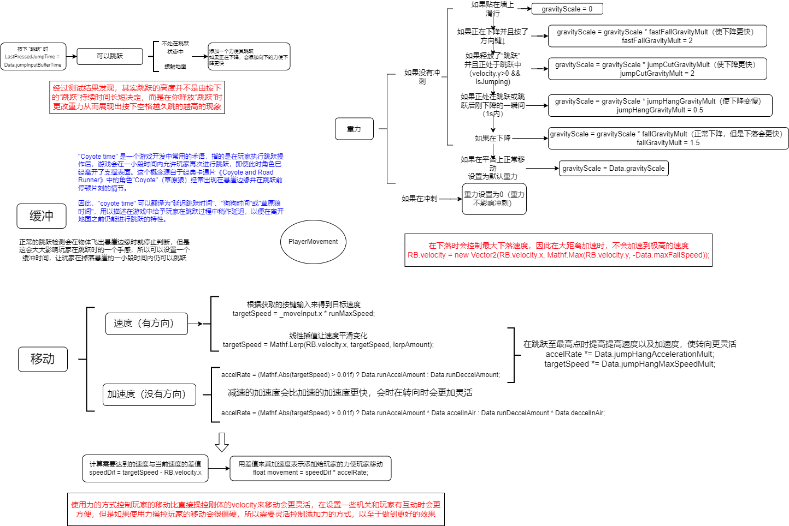
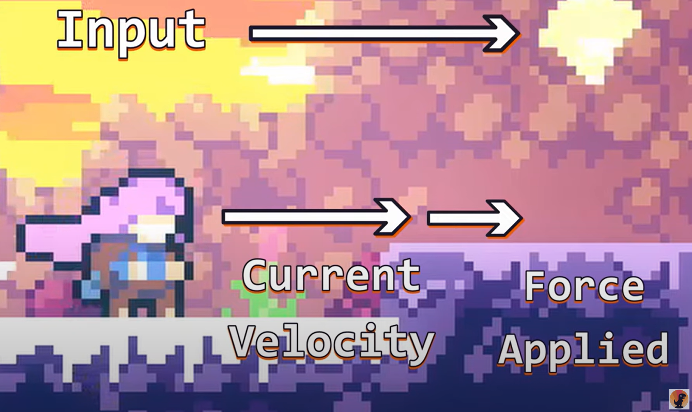

# 🗑️回收库🗑️

此回收库中的每个 Scene 都是一个学习后的内容并进行了复现，如果想看源码可以移步 github [👉点击此处](https://github.com/Shadow-Fy/SomeAbility)
所有此 README 中的内容都已经通过unity引擎进行了复现


## 🏃移动跳跃手感二次优化🏃

首先附上此教程的来源 [👉点击此处：Improve your Platformer with Acceleration | Examples in Unity - YouTube](https://www.youtube.com/watch?v=KKGdDBFcu0Q)
附上视频中的源码：[👉点击此处](https://github.com/DawnosaurDev/platformer-movement)
这是国外的一位大佬 🦕**Dawnosaur** 根据**蔚蓝**、**空洞骑士**、**超级肉肉男孩**这三款游戏的移动跳跃操作手感，制作的一视频，讲述了如何根据这些游戏来优化自己的游戏。
如果不能翻墙看原视频也可以通过此文了解到部分


附上一张自己整理的图便于理解这个


首先关于玩家的操作是有两部分负责：

1. 玩家本身的移动操作等，需要用代码进行实现。
2. 玩家进行移动操作的各种相关数据（包括移动速度、跳跃高度等等），这一部分通过 ScriptObject类 进行管理。

 如果你熟悉 MVC 架构的话看到这个可能你会突然眼前一亮或者对这位大佬的技术水平有了一小部分的认可（我开始也是这样的），如果不懂 MVC架构的话可以去查一下这是什么以及这样写的好处，废话不多说继续主题


### 移动

首先关于如何优化移动方式，大部分人写移动的代码都会如下：

```c#
public Rigidbody2D rb;
public Vector2 movementInput;
public float speed;

void Start()
{
    // 获取刚体
    rb = getComponent<Rigidbody2D>();
}

void Update()
{
    // 获取上下左右按键的输入
    moveInput.x = Input.GetAxisRaw("Horizontal");
	moveInput.y = Input.GetAxisRaw("Vertical");
}

void FixedUpdate()
{
    // 操作player移动
    rb.velocity = new vector2(speed * movemnetInput.x , rb.velocity.y);
}
```

大部分人在写角色的移动代码时应该和这个类似，并且是通过unity自带的物理引擎来实现会更为真实。

但是这样写有好处也会有一定的不方便之处： 

- 快速跑起来，对于初学者来说编码很简单并且反应灵敏。

+ 游戏移动没有加速或减速时间会让角色感觉想当僵硬化和机械化

+ 开发后期如果游戏中有设计一些较为复杂的道具需要和角色进行复杂的互动如传送带弹簧等对象变得困难，实现起来笨重


所以取而代之的是💪**力（Force）💪**，使用力可以获得更流畅的运动，并且结合了unity的物理引擎
但是如果自己之前尝试过使用力可能会发现不舒服，并且反应迟钝难以控制，所以需要通过代码进行优化。

首先创建角色的 ScriptObject类用于管理角色的属性值，具体属性值如下：

设置了三个属性值：最大速度、加速时的加速倍率、减速时的减速倍率
（这里和原作者的设置不一样，因为暂时不能理解原作者的设计思路所以直接进行了一个简化）

```c#
[CreateAssetMenu(menuName = "Player Data")]
public class PlayerData : ScriptableObject
{
    [Header("Speed")]
    // 角色移动时需要达到的最大速度
    public float runMaxSpeed；
    // 角色加速时倍率
    public float runAccelAmount;
   	// 角色减速时倍率
    public float runDeccelAmount;

}
```


在让角色移动时并不是直接给角色添加力就没有了，还需要对角色的力进行把控，如下图：*（图片已带上原作者的水印）*
图片将移动分成了三个部分，
🚩**Input**： 表示我们按下方向键后希望角色预期达到的速度
🚩**Current Velocity**： 表示角色当前的移动速度
🚩**Force Applied**： 表示我们还需要添加的力

添加的力会随着当前速度增大而减小，当速度达到最大就不需要再添加更多的力；最初开始移动时当前速度为0，所以会添加更多的力使得起步更快。
具体如何来控制我们可以利用 **速度差** ，用当前的速度和最大的速度求差，**使用这个差值来添加力**。



根据我们在 PlayerData 中创建好的三个属性值来创建角色移动的函数，代码实现效果如下：

```c#
void Run()
{
    // 让需要达到的最大目标速度获得方向（正负）
    float targetSpeed = moveInput.x * data.runMaxSpeed;
    // 加速倍率
    float accelRate;
    
    //根据是否移动获取加速倍率，如果是在移动获取加速的加速倍率；如果是停止移动，获取减速的加速倍率
    accelRate = (Mathf.Abs(targetSpeed) > 0.01f) ? data.runAccelAmount : data.runDeccelAmount;

    // 为了使添加力后的速度最终提高到我们设定的加速度，通过速度差来提高速度，并且这样会有更舒适的手感
    float speedDif = targetSpeed - rb.velocity.x;

    // 添加加速度等同于提高加速的倍率
    float movement = speedDif * accelRate;
    // 添加力移动玩家
    rb.AddForce(movement * Vector2.right, ForceMode2D.Force);
}
```


### 跳跃

